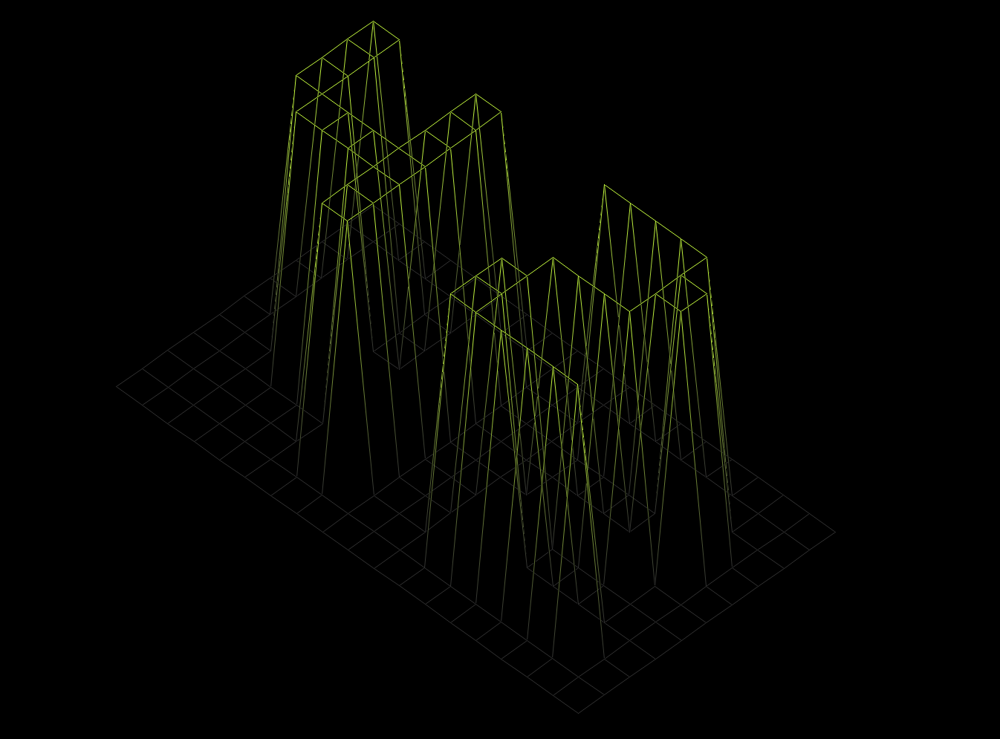

# FdF



## Descripción

FdF es un programa que convierte un mapa en 2D en una visualización 3D interactiva, permitiendo rotar y escalar la imagen para una mejor perspectiva.

## Instalación

1. Clona el repositorio:
   ```bash
   git clone https://github.com/Fernandomr23/FdF.git
   cd FdF
   ```
2. Compila el proyecto con:
   ```bash
   make
   ```
3. Ejecuta el programa:
   ```bash
   ./fdf [ruta_al_archivo_del_mapa]
   ```

## Uso

- **Rotación:** `X`, `Y`, `Z`
- **Escalado:** `+`, `-`
- **Movimiento:** Flechas del teclado

## Archivos de Mapa

Los mapas son archivos de texto con matrices de números que representan alturas. Ejemplos disponibles en la carpeta `maps`.

## Dependencias

FdF usa la biblioteca `mlx`. Consulta [minilibx-linux](https://github.com/42Paris/minilibx-linux) para más detalles.
